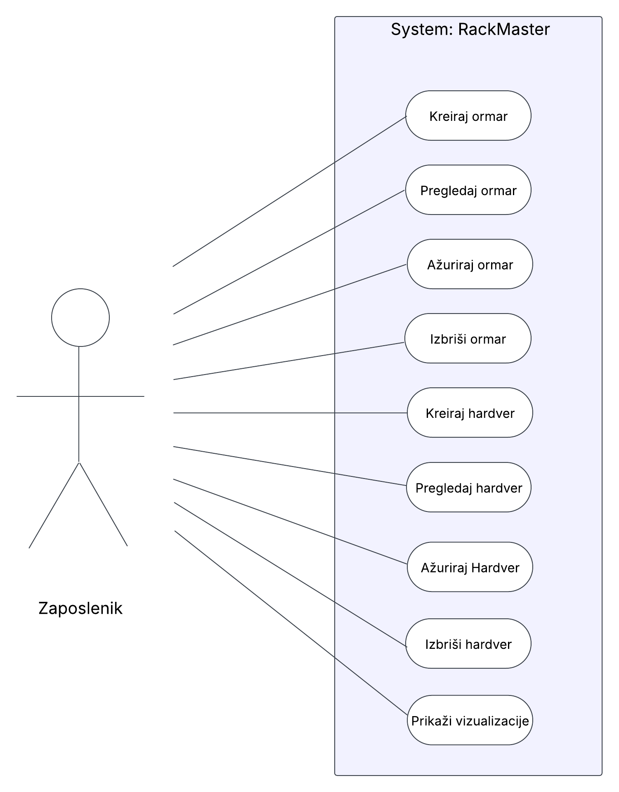

# RackMaster

## RackMaster - Aplikacija za upravljanje IT opremom

RackMaster je web aplikacija razvijena kao projekt za kolegij Informacijski sustavi. Aplikacija omogućuje upravljanje i praćenje IT hardverske opreme unutar podatkovnih centara. Korisnici mogu unositi, pregledavati, ažurirati i brisati podatke o serverskim ormarima i hardverskim komponentama koje se u njima nalaze, kao i vizualizirati popunjenost i status opreme. Time se olakšava organizacija i održavanje opreme.

## UseCase dijagram



## Funkcionalnosti

* **Upravljanje ormarima (CRUD):** Kreiranje, pregled, ažuriranje i brisanje serverskih ormara.
* **Upravljanje hardverom (CRUD):** Dodavanje, pregled, ažuriranje i brisanje hardverskih komponenti (serveri, switchevi, routeri...).
* **Povezivanje opreme:** Svaki komad hardvera je povezan s točno određenim ormarom.
* **Vizualizacija popunjenosti ormara:** Grafički prikaz popunjenosti svakog ormara po rack unitima (U).
* **Vizualizacija statusa opreme:** Grafički prikaz statusa sve opreme (Aktivno, Neaktivno, Servis).
* **Sigurnosna provjera:** Onemogućeno brisanje ormara koji u sebi sadrži hardver.

## Kako pokrenuti aplikaciju lokalno

Za pokretanje aplikacije potrebno je imati instaliran **Docker** i **Docker Compose**.

1.  **Klonirajte repozitorij:**
    ```bash
    git clone https://github.com/tvoje-ime/rackmaster.git
    cd rackmaster-projekt
    ```

2.  **Izgradite Docker sliku:**
    Ova naredba će izgraditi Docker image prema uputama iz `Dockerfile`-a.
    ```bash
    docker-compose build
    ```

3.  **Pokrenite aplikaciju:**
    Ova naredba će pokrenuti kontejner. Aplikacija će se pokrenuti s testnim podacima.
    ```bash
    docker-compose up
    ```

4.  Aplikacija je sada dostupna u vašem pregledniku na adresi **[http://localhost:5000](http://localhost:5000)**.

## Tehnologije

- **Backend**: JavaScript, Python, Flask, PonyORM, 
- **Frontend**: HTML, CSS
- **Docker**: Dockerfile, Docker Compose

## Autor

**Marko Telešman**, 0035167326, FIPU 2024/2025